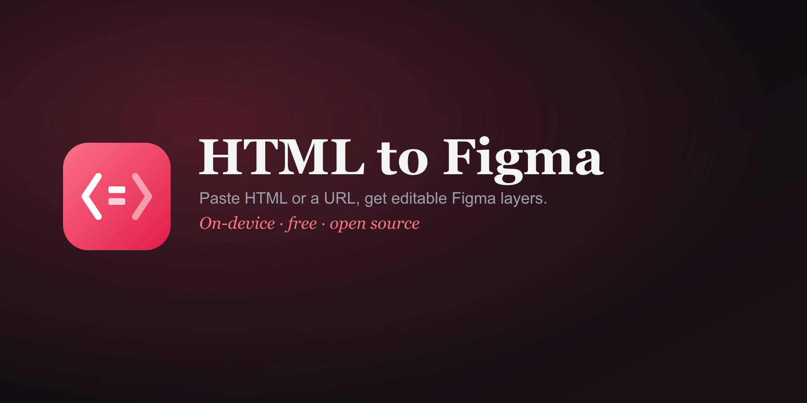

# HTML to Figma

Paste HTML or a URL and get **editable Figma layers** — frames, text, images,
fills, borders, radius, opacity and shadows, from the page's computed CSS. Not a
screenshot. Runs on your device.

## Plain, 3 files — no build
- `manifest.json` — plugin config (`documentAccess: dynamic-page`, network for URL/image fetch, relaunch button)
- `code.js` — the sandbox: builds Figma layers from a parsed DOM tree (relative nesting, images, drop-shadows)
- `ui.html` — native Figma `<fig-*>` UI (Paste HTML / From URL / viewport width), auto-resizes, fetches images

## Install (development)
Figma **desktop** → Plugins → Development → **Import plugin from manifest…** →
select `manifest.json`. Run it, paste HTML, click **Convert to Figma**.

> The `<fig-*>` UI only renders inside Figma — opening `ui.html` in a browser looks blank. That's expected.

## Publish (free, Community)
1. Import + test (above).
2. Plugins → Development → HTML to Figma → **Publish…**
3. Paste from `LISTING.md`; upload `assets/icon-128.png` + `assets/cover.png`.
4. Audience **Everyone**, price **Free** → Submit. Figma reviews ~1–2 days.

## Limits
- Gradients, `<canvas>`/WebGL, and background-images simplify or drop.
- Cross-origin images without CORS can't be captured (they'll come in as boxes).

MIT · by [Ankur Sinha](https://sinhaankur.com).
