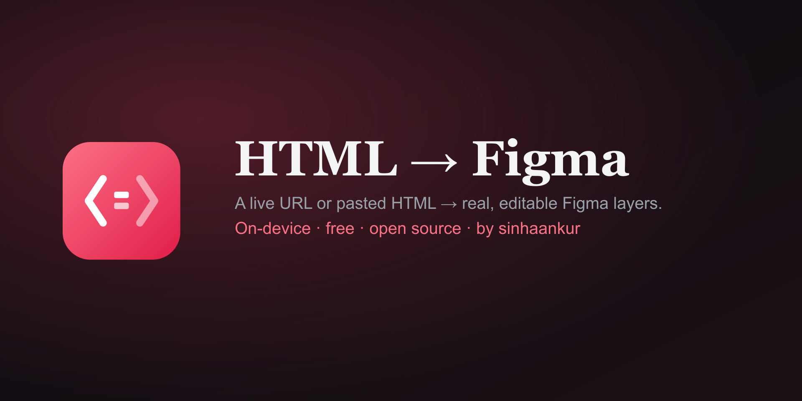

# HTML → Figma — by sinhaankur

Turn a **live URL** or **pasted HTML** into **editable Figma layers** — real
frames, text and fills read from the page's computed CSS. Not a screenshot.



- **Paste HTML** or **From URL** (fetches the page's HTML; falls back to paste if a
  site blocks cross-origin).
- Choose a viewport width (390 / 1056 / 1440 or custom) — the page renders at that
  width and every element is positioned from its on-page box.
- Each element → a Figma **rectangle** (fills, border, corner radius, opacity) or
  **text** node (font family/size/weight/italic, color, alignment, line-height).
- Runs **on your device**; pasted-HTML mode uses no network at all.

## Tested core
`src/css-core.ts` maps CSS computed values → Figma values (color parsing incl.
modern `rgb()/`-alpha, font-weight → style, radius, align, renderability). 22-check
suite: `npm test`.

## Install (development)
```bash
npm install
npm test          # 22/22
npm run build     # → dist/code.js + dist/ui.html
```
Figma desktop: **Plugins → Development → Import plugin from manifest…** → `manifest.json`.

## Limits
- Gradients, box-shadows, `<canvas>`/WebGL, and background images simplify or drop
  (a WebGL hero becomes an empty box). Complex CSS is approximated.
- Images aren't embedded yet (placed as boxes) — same-origin image capture is a
  planned pass.

## Launch
Free & open source (MIT). Intended for the Figma Community — see the repo's
[LAUNCH.md](../LAUNCH.md) for publishing steps.
